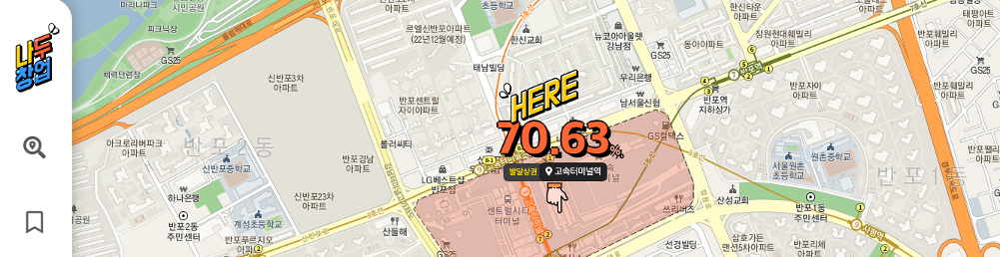
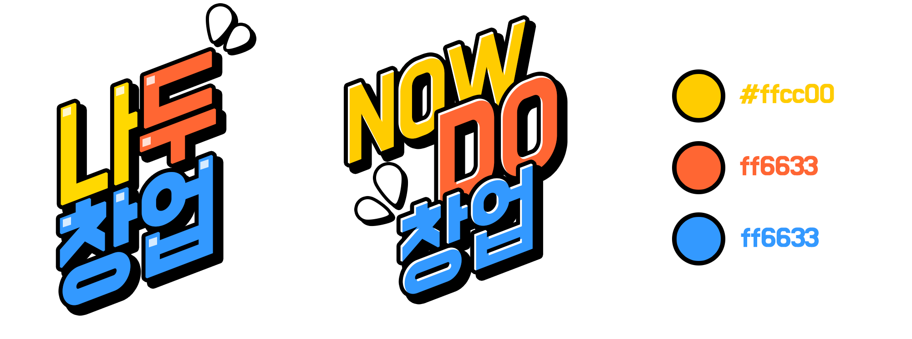
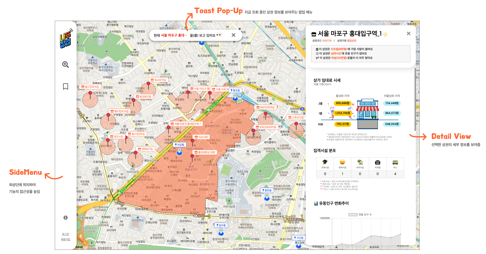
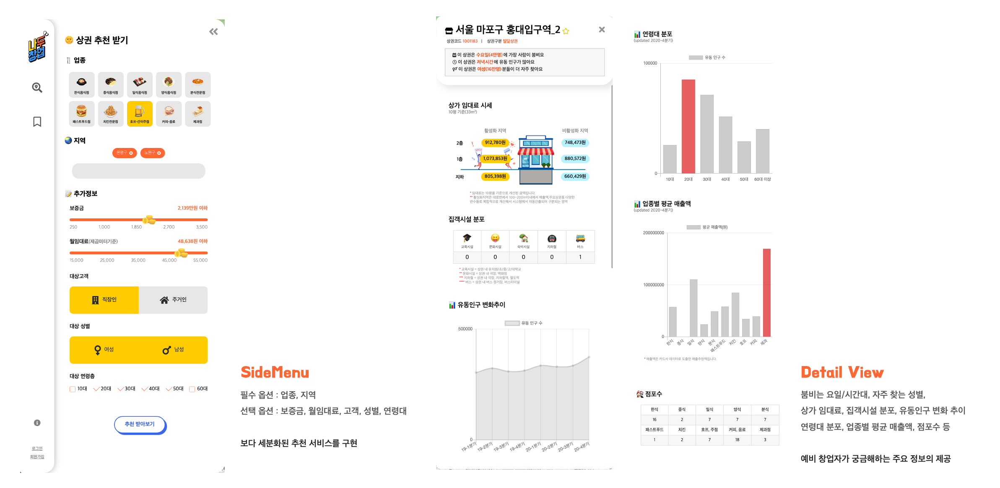
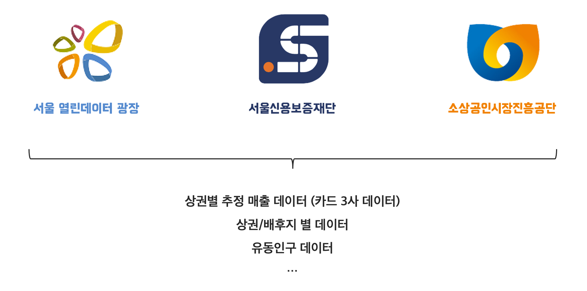
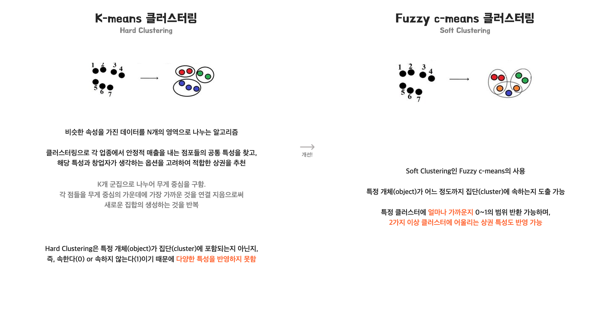
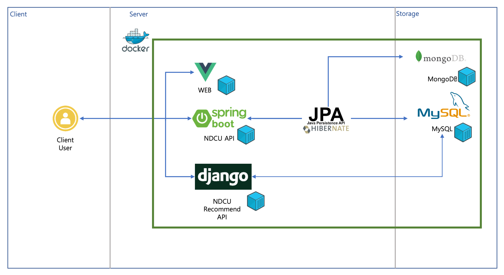

# 📊 나두창업, NOW DO 창업

Fuzzy c-means 클러스터링 알고리즘을 기반으로 후보 상권지를 추천하는, 상권 추천 및 분석 서비스 🖥

🚧 [LIVE SERVICE](http://j4a106.p.ssafy.io/)

<br>

## 🕺 팀원 소개

|                   팀장                   |                 팀원                  |                팀원                 |                  팀원                  |                 팀원                  |
| :--------------------------------------: | :-----------------------------------: | :---------------------------------: | :------------------------------------: | :-----------------------------------: |
| [이주상](https://github.com/stateaward) | [김수연](https://github.com/xsw7563) | [김수진](https://github.com/5ujin) | [김한솔](https://github.com/pinest94) | [장재용](https://github.com/kaslock) |
|                   👨‍🎨 Front-End                   |                 👨‍🎨 Front-End                  |                👨‍🎨 Front-End                 |                  🧑‍💻 Back-End                  |                 🧑‍💻 Back-End                  |

<br>

## 👀 프로젝트 개요

-  📆 프로젝트 기간
   -  2021.03.01 ~ 2021.04.09 (6 week)
-  📌 기획 배경

   -  창업에 대한 사회적 지원과 관심 But, 가게 10곳이 오픈하면 8곳이 폐업하는 현실
   -  음식점 창업자의 72.5%가 준비 기간 6개월 미만, 창업 준비 미비
   -  서울시 내 상권 분석 서비스(3개) 존재 But, 상권 추천 서비스 미제공

-  👓 메인 타겟

   -  상권 분석을 어디서 부터 해야하는지 모르는, 초보 창업자
   -  다양한 상권을 비교하며 적합한 상권을 찾길 원하는, 예비 창업자

-  💍 핵심 가치

   -  **객관성/신뢰성**
      -  창업과 직결되기 때문에 주관정 정보가 아닌, 객관적이고 신뢰성 높은 정보가 필요 ➡️ 빅데이터에 기반한 정보 제공
   -  **접근성**
      -  상권 탐색을 통해, 다양한 상권을 보다 쉽게 접근할 수 있어야함 ➡️ 직관적 UI/UX를 통해 접근성 향상
   -  **실용성**
      -  예비 창업자가 정말 필요로 하는, 실용적인 기능이 필요 ➡️ `Fuzzy c-means Clustering`을 기반으로 추천 기능 제공

- 🗄 산출물
  - [🔖 기획 발표 자료](docs/presentation/특화PRJ_A106_기획발표.pdf) : `PMI 기법` 을 통한 아이디어 도출 과정, 와이어프레임 등
  - [🔖 최종 발표 자료](docs/presentation/특화PRJ_A106_최종발표.pdf) : 기획 배경부터 서비스 소개까지
  - [📽 시연 영상 (01:52)](https://youtu.be/XoMm4SuEsns)

-  🥇 성과

   -  특화 프로젝트 1등 (우수상)
   -  우수 프로젝트 선정

<br><br>

## 💁‍♂️ 프로젝트 소개



<br>

**나두창업**은 '나도 창업을 할 수 있다' 는 뜻과 '지금 당장 창업을 하도록 도와준다'는 **Now Do 창업** 두 가지 의미를 담고있는  
`상권 추천 및 분석 서비스` 입니다.
<br><br>
요식업 창업의 성패는 _*어디서 창업하느냐 !*_ 하지만, 상권 분석은 예비 창업자에겐 여전히 어려운 영역입니다. 저희는 기획 조사를 통해, 창업에 대한 지원과 서울시에서 3개의 상권 분석 서비스를 제공하는 만큼 높은 사회적 기대가 있음을 확인했습니다. 하지만 기존 서비스에서 상권 추천 서비스가 제공되지 않아, 예비 창업자가 상권 분석에 어려움이 있음을 발견하였습니다. 저희는 예비 창업자가 입력한 조건에 따라 적합한 상권을 추천해주는 서비스를 개발하고자 **상권 추천 및 분석 서비스, 나두창업**을 개발하였습니다.
<br><br>
**상권 추천 및 분석 서비스, 나두창업**은 머신 러닝 알고리즘을 통한 상권 추천을 제공합니다. 사용자가 선택한 요식 업종에 따라 서울시 전체 상권을 클러스터링으로 군집화를 실시합니다. 그 후 추가 입력 조건에 따라 필터링을 실시, `centroid`와의 거리를 계산하여 추천 지수를 산정합니다. 특히 상권에 대한 다양한 속성값을 반영하기 위해 기존의 하드 클러스터링 방식인 `K-means Clustering`에서, 소프트 클러스터링 방식의 `Fuzzy c-means Clustering`으로 고도화를 실시하였습니다.
<br><br>
저희는 빅데이터에 기반하여 예비 창업자가 필요로 하는 다양한 정보(유동 인구, 임대료, 점포수, 매출액 추이 등)를 제공합니다. 다양한 정보를 직관적으로 전달하기 위해 직관적인 이미지를 디자인하여 개발에 활용하였으며, 그래프를 통해 많은 정보를 보기 쉽게 제공합니다. 우수프로젝트 리뷰 간, '실제 서비스 하는 것 같은 UI/UX 이다'라는 평가를 받았습니다.

<br>

## 💡 주요 기능

### 1️⃣ 상권 추천 기능


> 사용자가 입력한 조건에 따라 적합한 상권을 추천하는 기능

<br>


> 추천 받은 상권을 클릭시, 상권의 세부 데이터를 확인 할 수 있음   
> 상단 토스트 팝업을 통해, 자신의 상태를 직관적으로 표현 및 서비스 사용성을 높임

<br>

<br>

### 2️⃣ 상권 탐색 기능


> 지도를 탐색하며 행정동(폴리곤) 영역 내의 상권을 자유롭게 탐색하는 기능   
> 지도의 확대 수준에 따라 폴리곤으로 지역의 경계를 표시(vworld API 활용)


<br>


> 상권이 많은 동의 경우, 클러스터링을 통해 밀집 정도를 표시함

<br>

<br>

### 3️⃣ 북마크 기능 with 로그인


> 마음에 드는 상권을 북마크에 추가하고, 즉각 연결할 수 있는 기능

<br>

<br>

## 🖼 UI 소개






---

<br>

## 📈 데이터 분석

### 사용 데이터셋



> `서울시 우리마을가게 상권분석서비스` 데이터셋을 기반으로 신뢰성을 확보함

<br>

### 추천 알고리즘



---

<br>

## 🗂 서비스 아키텍쳐 



- 👨‍🎨 **Front-End**
  - Language
    - 
  - Framework / Library
    -  
  - Design
    -   
  - open API
    -  

- 🧑‍💻 **Back-End**
  - Language
    -  
  - Server
    -   
  - Data
    -    
  - Delivery
    - 

- 👨‍👩‍👦 **Common**
  - Co-work
    -   


---

## 👊 Installation
- 👨‍🎨 **Front-End**
   ```
   cd frontend
   npm install
   npm run serve
   ```

- 🧑‍💻 **Back-End**
   ```
   write here
   백엔드 관련 기술 문서가 많을 경우, docs 폴더 내 파일 업로드 후 페이지 연결하기!
   ```


<br>
<br>

**Fin.**